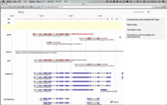
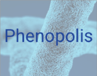

# Users
These are projects or institutions that are pioneering the use of Bionode.io

## Universities
### [QMUL](http://qmul.ac.uk)
  
[afra.sbcs.qmul.ac.uk](http://afra.sbcs.qmul.ac.uk) (Gene Annotation for the Masses)

  
[genevalidator](https://wurmlab.github.io/tools/genevalidator) (Identify problems with protein-coding gene predictions)

  
[geodiver.co.uk](http://www.geodiver.co.uk) An easy to use web tool for analysing GEO datasets
### [UCL](https://www.ucl.ac.uk)
  
[phenopolis.github.io](http://phenopolis.github.io) An Open Platform for Harmonization & Analysis of Sequencing & Phenotype Data.

## Startup
### [repositive.io](http://repositive.io)
  
[repositive.io](http://repositive.io) One-click access to human genomic data

## Open Source Organization

### [fathomlabs.io](http://fathomlabs.io)
  
[openretractions.com](http://openretractions.com) Check for retraction notices of any journal article*
